# 13. 자료 구조 (Data Structure)

## 배열의 한계 
* 배열은 여러개의 변수를 활용 하기에 매우 좋은 자료형이다. 
* 다만, 배열은 struct 등 큰 데이터를 관리할 때 치명적인 단점이 있다. 
* 처음에 메모리 크기를 지정 해주어야 하기 때문에, 넉넉하게 잡아 주어야 하고 모두 사용하지 않을 가능성도 높아 메모리가 낭비 된다. 
* 처음에 잡아준 크기 보다 더 많은 데이터를 저장 해야 할경우 새로 배열을 할당해서 모두 복사하는등 과정이 까다롭다. 
* 배열 중간에 값을 삽입하거나, 값을 삭제하는 경우도 과정이 까다로울수 밖에 없다. 

## 연결 리스트 (Linked List) 
* 배열의 메모리 낭비를 막고, 삽입, 삭제의 까다로움을 완화 시킨 형태의 자료 형을 **연결 리스트(Linked List)** 라고 한다. 
* 연결 리스트는 메모리를 처음부터 메모리 크기를 할당하지 않고, 필요할 때마다 하나하나 동적으로 할당하여 사용해 메모리의 낭비를 막는다. 
* 값을 삽입하고, 삭제하는 과정도 매우 간결하다. 
* 연결 리스트의 값이 저장되고, 삽입 삭제 되는 과정을 통해서 쉽게 파악 할 수 있다. 

## 노드(Node)
* 데이터가 필요 하면 struct 형태로 데이터를 동적 메모리 할당을 통해서 만든다. 이를 **노드(Node)** 라고 한다. 
* Node 의 특징은 다음에 오게 되는 데이터의 포인터를 가진다는 것이다. 
	*  다음에 오는 데이터라함은 배열에서 index 0의 데이터와 index 1 의 데이터 라고 생각하면 된다. 
*  처음 생성 되었을 때는 다음 데이터가 없기 때문에 포인터는 NULL을 가지고 이것을 통해서 마지막 노드 임을 구분한다.  

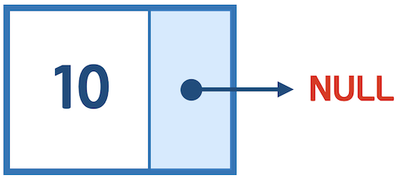

* C 언어로 표현하면 아래와 같다. 

```
typedef struct _Node {
    int number;
    struct _Node *next;
} Node;

int main() {
    Node *node1 = (Node *)malloc(sizeof(Node));
    node1->number = 10;
    node1->next = NULL;    
}
```

## 노드 추가

* 새로운 노드를 추가하기 위해서 똑같은 형태의 struct 노드를 만든다. 
* 새로운 노드는 마지막 노드가 되기 때문에 다음 노드 포인터를 NULL로 해준다. 

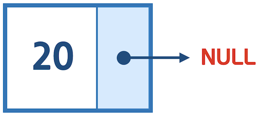

```
Node *node2 = (Node *)malloc(sizeof(Node));
node2->number = 20;
node2->next = NULL;
```
* 기존의 노드에 드디어 다음 노드가 생겼다. 기존 노드의 다음 노드 포인터에 새롭게 추가한 노드를 연결해 준다. 

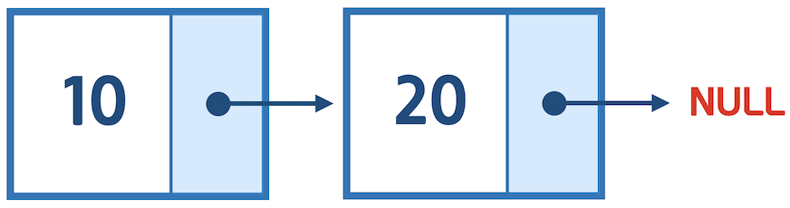

```
node1->next = node2;
```

* 이렇게 반복하면 이러한 형태로 연결하면 배열과 같이 여러개의 데이터가 저장된 리스트가 만들어 진다. 

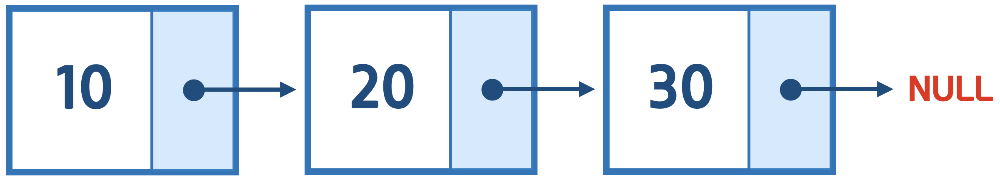

```
int main(int argc, const char * argv[]) {

    Node *node1 = (Node *)malloc(sizeof(Node));
    node1->number = 10;
    node1->next = NULL;

    Node *node2 = (Node *)malloc(sizeof(Node));
    node2->number = 20;
    node2->next = NULL;

    node1->next = node2;

    Node *node3 = (Node *)malloc(sizeof(Node));
    node3->number = 30;
    node3->next = NULL;

    node2->next = node3;
}
```

## 전체 검색
* 배열은 index를 통해서 쉽게 값에 접근이 가능하지만, 연결 리스트는 모든 값을 거치면서 연결을 타고 가야 한다. 

```
Node *pointer = node1;
while(pointer != NULL) {
    printf("%d ", pointer->number);
    pointer = pointer->next;
}
printf("\n");
```
* 포인터를 이용해서 각 노드를 하나씩 검색한다. 

`Node *pointer = node1;`

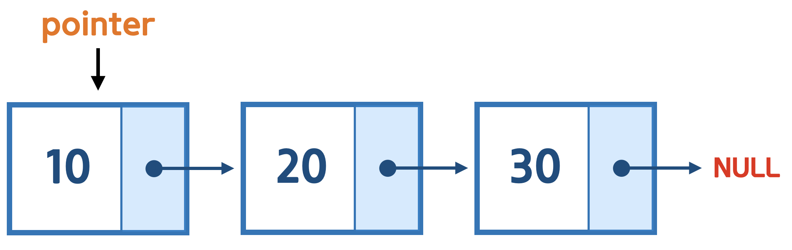

* 탐색을 위한 포인터를 만들고 첫번쨰 노드를 가르키도록 한다. 

`pointer = pointer->next;`

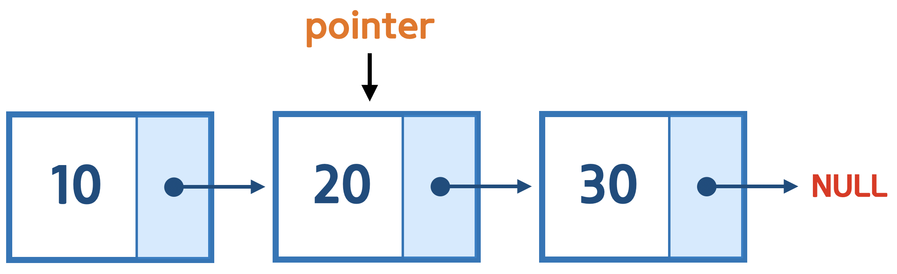

* 포인터의 값을 현재 포인터의 다음값으로 바꿔 줌으로써 다음 포인터가 다음 값을 가르키도록 한다. 

```
while(pointer != NULL) {
    printf("%d ", pointer->number);
    pointer = pointer->next;
}
```

* pointer 가 NULL이 될때까지 포인터의 이동을 반복하면서 끝까지 검색 할 수 있게 된다. 
* 해당 포인터의 값을 출력하면, 모든 값을 출력 할 수 있게 된다. 

> 출력 결과 

```
10 20 30 
```
## index 검색
```
int index = 1;
pointer = node1;
for(int i = 0; i < index; i++) {
    pointer = pointer->next;
}
printf("%d\n", pointer->number);
```
* 포인터를 이동하는 반복문을 NULL까지가 아닌 특정 index 만큼만 이동 시킨다. 
* 이동이 완료 되면 해당 위치의 값을 출력 해준다. 

> 출력 결과 

```
20
```

## 노드 삽입
* 기존 리스트의 중간에 노드를 삽입 할 수 있다. 
* 배열에 비해 간단한 방법으로 삽입이 가능하다. 

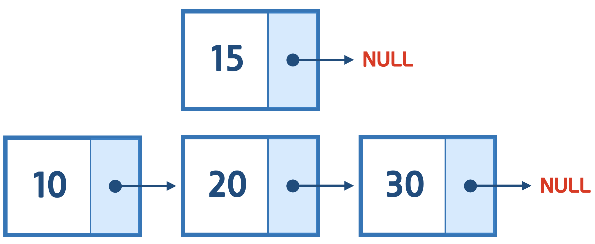

```
Node *newNode = (Node *)malloc(sizeof(Node));
newNode->number = 15;
newNode->next = NULL;
```
* 15라는 값을 가진 새로운 노드를 10과 20 노드 사이에 삽입 하려고 한다. 

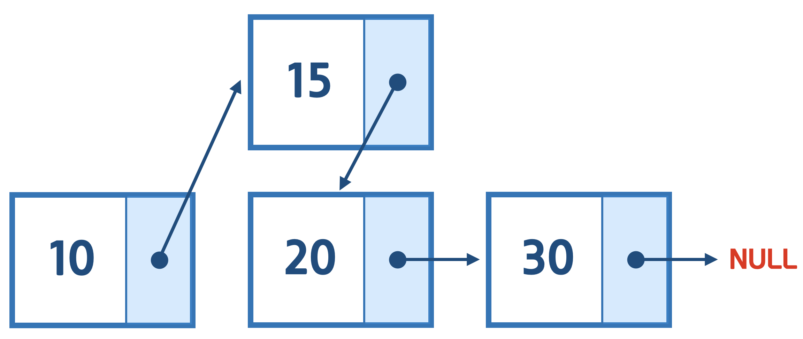

```
newNode->next = node2;
node1->next = newNode;
```
* 새로운 노드의 next 를 위치하고자 하는 자리의 앞 노드(node1)의 next로 교체해준다. 이를 통해서 새로운 노드 다음의 노드를 설정해준다. 
* 위치하고자 하는 자리의 앞 노드(node1)의 next 를 새로운 노드로 바꿔준다. 이를 통해서 새로운 노드가 10노드의 다음 노드가 된다. 
* 각 노드의 next 만 수정해주면서 새로운 노드를 삽일 할 수 있게 된다. 

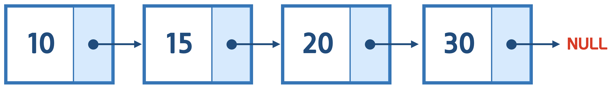

* 정리하면 위와 같이 된다. 

```
index = 1;
pointer = node1;
for(int i = 0; i < index - 1; i++) {
    pointer = pointer->next;
}
    
newNode->next = pointer->next;
pointer->next = newNode;
```

*  node1 을 직접 쓰지 않고, index 를 통해서 확장성있게 삽입을 할 수 있다. 

`for(int i = 0; i < index - 1; i++)`

* 삽일할 위치 index 보다 하나전의 노드를 통해서 연결 할 수 있기 때문에 반복문 수행을 index - 1 만큼 반복해야 한다. 

## 노드 삭제

* 삽입과 마찬가지로 삭제도 간단한 포인터 연산으로 가능하다. 

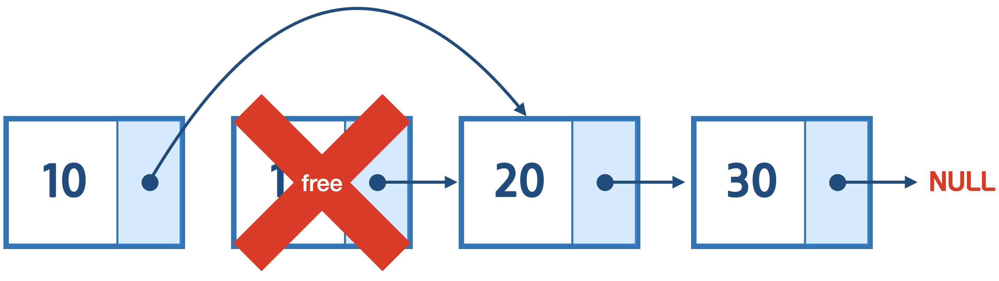

```
node1->next = newNode->next;
free(newNode);
```
* 삭제할 대상 노드의 앞 노드(node1) 의 next 를 삭제 대상 노드(newNode)의 next로 바꿔 준다.
* 삭제 대상 노드는 free를 통해서 메모리를 해제해 준다. 

```
index = 1;
pointer = node1;
for(int i = 0; i < index - 1; i++) {
    pointer = pointer->next;
}
Node *taget = pointer->next;
pointer->next = taget->next;
free(taget);
``` 
* node1 을 직접 쓰지 않고, index 를 통해서 확장성있게 삭제 할 수 있다. 
* 삭제할 대상보다 앞 노드를 통해서 처리 해야 하기 때문에, 반복문 수행은 index-1 만큼 수행 해야 한다. 

[예제 보기](ex/ex01.c)

## 배열 처럼 사용 하기 

* 리스트를 명확히 활용 하기 위해서는 배열 처럼 하나의 변수로 모든 처리를 할 수 있어야 한다. 
* 위와 같은 사용법은 여러 변수를 사용 했기 때문에, 정확한 사용법은 아니다. 
* 배열처럼 하나의 이름으로 리스트를 사용하고, 인덱스를 통해서 값을 저장 하고, 검색한다. 

## head 활용
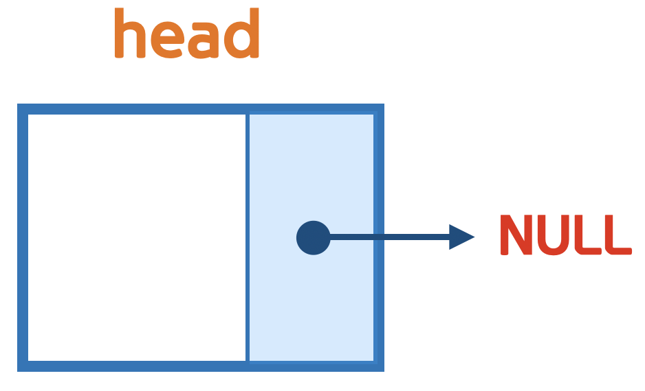

```
Node *head = (Node *)malloc(sizeof(Node));
head->next = NULL;
```

* head 는 배열의 이름과 같이 리스트를 나타내는 노드이다.
* 리스트가 아무 값이 없을때, 리스트를 관리 할 수 없으므로 기본 노드를 만들어서 관리 한다.  
* head 는 값을 가지지 않는 빈 노드이고 첫번째 노드를 가르키는 역할만한다. 

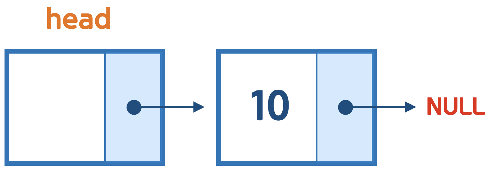

```
Node *node1 = (Node *)malloc(sizeof(Node));
node1->number = 10;
node1->next = NULL;

head->next = node1;
```

## 함수를 통한 활용 
* 모든 리스트 접근은 head 와 그를 기반으로한 포인터 변수만 활용한다. 
* 이를 통해서 배열과 같이 간편하게 사용 하고, 메모리 낭비를 막는 완전한 리스트가 완성 된다. 

* 완성된 연결 리스트 결과는 아래 소스코드 참조 

[예제 보기](ex/ex02.c)


## 연결 리스트의 단점 
* 연결 리스트는 배열 처럼 index를 바로 참조해서 사용 할 수 없고, 처음 부터 하나 하나 반복하면서 원하는 값에 접근 할 수 있기 때문에 검색 속도는 배열보다 느리다. 

## 자료 구조 
 * 이렇게 데이터의 특성에 맞게 데이터를 다루는 방식을 **자료 구조 (data structure)** 라고 한다. 
* 자료 구조는 데이터를 어떻게 하면, 더 빠르고 간결하게 처리 할 것인지에 대한 연구의 결과로 매우 많은 형태가 있다. 
	* 연결 리스트, 배열, 스택, 큐, 트리, 그래프
* 프로그래밍에 있어서 데이터를 다루는 능력은 매우 중요하기 때문에, 자료구조를 잘 다루는 것이 프로그래밍을 잘 할 수 있는 밑거름이 된다. 
