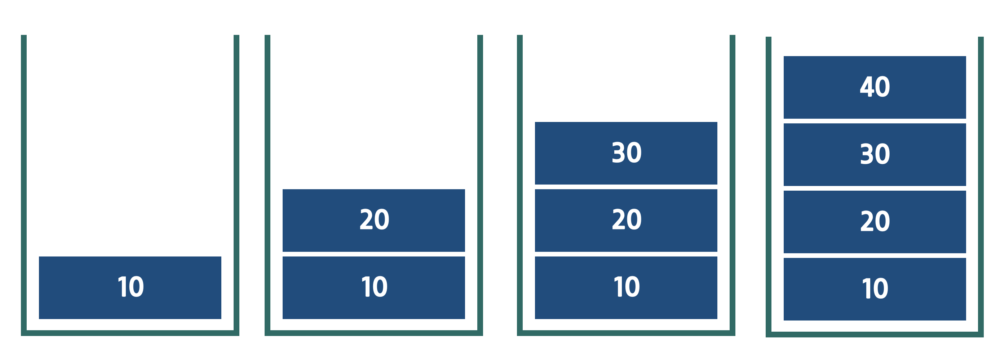
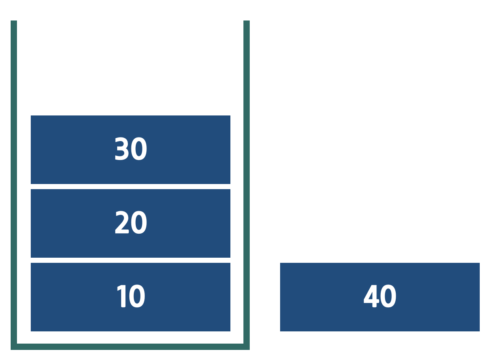
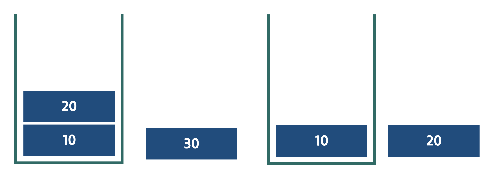
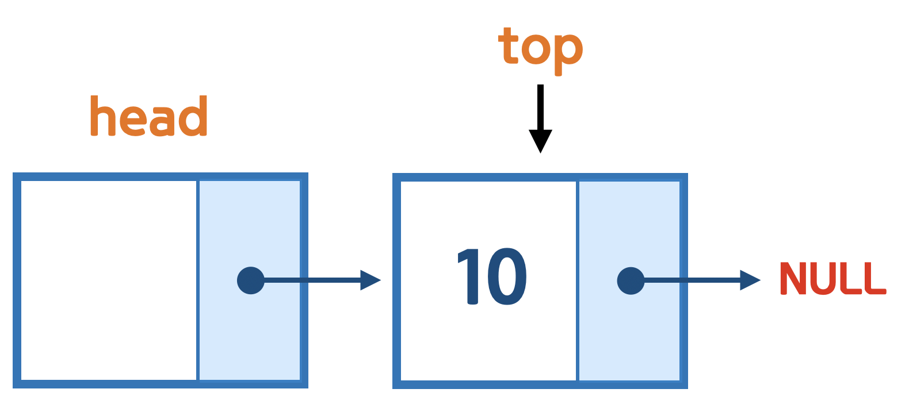
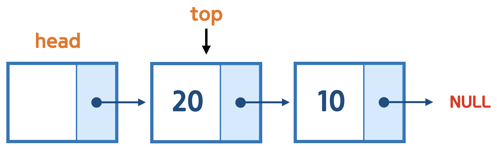

# 14. 스택 (stack)

## 입구가 하나인 상자 



* 입구가 하나인 상자에 값을 하나씩 넣으면 위와 같이 쌓인게 된다. 
*  넣은 값을 다시 꺼낼 때는 어떤 순서일까?

 

* 입구가 하나이기 때문에, 꺼낼떄는 가장 위의 값을 꺼내게 된다. 
* 즉, 가장 최근에 넣은 값이 가장 먼저 꺼내어진다. 



* 그 이후로도 순서대로 나중에 넣은 값이 먼저 꺼내어 지고, 가장 처음에 넣은 값이 가장 나중에 꺼내어 진다. 
* 이를 후입 선출, 혹은 **LIFO(List In First Out)** 이라고 한다. 


## 스택
 * 후입 선출, LIFO의 특성을 가진 자료구조를 스택이라고 한다. 
 * 스택은 프로그래밍 내부적으로 많이 사용 되고, 수학적인 부분에도 사용이 된다. 
 * 컴퓨터를 사용 할때, 되돌리기(undo) 에서 스택이 활용 된다. 
	 * 되돌리기를 하면 가장 최근에 했던 작업 부터 복구가 된다. 

## 스택의 기능

* push
	* 스택에 값을 저장 한다. 값은 기존 데이터의 뒤로 쌓인다. 
* pop
	* 스택에서 값을 꺼낸다. 가장 위에 있는 값을 얻고, 스택에서 없앤다.
	* 스택안에서 값을 꺼내기 때문에, 스택에서 값은 지워진다. 
* top
	* 스택에서 가장 위에 값을 얻는다. 
	* 값만 확인 하는 기능으로 스택에서 값이 사라지지 않는다. 
* empty
	* 스택이 비어 있는지 알려 준다. 

## 배열을 이용한 스택 구현
*  배열을 통해서 스택을 구현 할 수 있다. 
*  데이터가 저장 되는 입구가 하나이기 때문에, 배열에 저장될 위치를 잡아 주는 것이 중요하다. 

| [0] | [1] | [2] | [3] | [4] | [5] | [6] | [7] | [8] | [9] |
|:---:|:---:|:---:|:---:|:---:|:---:|:---:|:---:|:---:|:---:|
| 0  | 0  | 0  | 0  | 0  | 0  | 0  | 0  | 0  | 0  |

* 위와 같은 배열이 있다고 할때, 배열의 끝 부분 index 9 부분을 을 입구라고 생각하고, 0 에서 부터 값이 쌓인다고 생각 하면 된다. 
* 쌓인 마지막 값인 top의 index의 위치를 표시할 변수를 추가해서 관리 한다. 

```
int stack[10] = {0, };
    
int topIndex = -1;
```
* 10개의 수를 저장 하는 스택 공간을 만들고, 입구를 표시할 topIndex를 선언한다. 
* top은 가장 위 를 의미하기 때문에 값이 없는 상태는 -1로 초기화 한다. 

```
topIndex++;
stack[topIndex] = 10;
    
topIndex++;
stack[topIndex] = 20;
    
topIndex++;
stack[topIndex] = 30;
    
topIndex++;
stack[topIndex] = 40;
```
* push 하는 과정이다. topindex 를 추가하고 해당 index에 값을 넣는다. 

|   |  |  | top |  |  | |  |  |  |
|:---:|:---:|:---:|:---:|:---:|:---:|:---:|:---:|:---:|:---:|
| [0] | [1] | [2] | [3] | [4] | [5] | [6] | [7] | [8] | [9] |
| 10  | 20  | 30  | 40  | 0  | 0  | 0  | 0  | 0  | 0  |

* push 한 결과는 위와 같다. 

```
int number = stack[topIndex];
```
* top 을 하는 과정이다. 
* topindex의 값을 변수에 넣으면 top의 값을 구할 수 있다. 

```
int number = stack[topIndex];
topIndex--;
```
* pop 을 하는 과정이다. 
* topindex 위치의 값을 변수에 저장 하고, topindex 를 1감소 시킨다. 
* topindex 자체가 가장 위의 값을 나타내기 때문에, 이를 1 감소 시키면, 그 다음 값이 top이 되면서 기존의 top은 없어지는 것과 같이 된다. 

|   |  | top |  |  |  | |  |  |  |
|:---:|:---:|:---:|:---:|:---:|:---:|:---:|:---:|:---:|:---:|
| [0] | [1] | [2] | [3] | [4] | [5] | [6] | [7] | [8] | [9] |
| 10  | 20  | 30  | 40  | 0  | 0  | 0  | 0  | 0  | 0  |

* [3] 값은 40이 저장 되어 있지만, 이미 top이 [2] 를 가르키기 때문에 의미가 없어 진다. 

[예제보기 ](ex/ex01.c)

## 전역 변수와 함수를 이용한 스택 구현
* 전역 변수는 main 바깥쪽에 만들어진 변수를 의미 한다. 
* 지역 변수와 반대 되는 의미로 지역 변수는 { } 범위 안에서만, 의미를 가지기 때문에, 함수 밖에서는 사용 할 수 없다. 
* 전역 변수는 모든 함수 바깥쪽에 선언 되어 있기 때문에, 모든 함수에서 자유롭게 사용 할 수 있다. 
* 다만, 프로그램이 종료 될때 까지 계속 메모리 공간을 차지하고, 값이 모든 곳에서 접근 가능하기 때문에, 안정성이 떨어 진다. 

```
int stack[10] = {0, };
int topIndex = -1;

int main() {
	return  0;
}
```

* 전역변수로 스택을 선언하였다. 
* 전역 변수로 스택을 구현했기 때문에, 함수를 통해서 기능 별로 구현 할 수 있다. 

```
int isFull() {
    if(count() == 10){
        return 1;
    }
    
    return 0;
}

void push(int value) {
    if(isFull()) {
        printf("push 실패\n");
        return ;
    }
    
    stack[++topIndex] = value;
}
```
* push 를 구현한 함수 이다. 
 
 `stack[++topIndex] = value;`  
 
 * 전역 변수로 접근해서 파라미터로 받은 value를 저장 하도록 하였다.   
 * 전위 연산자를 통해서 topIndex의 값을 간단히 한줄로 표현하였다. 

`if(isFull())`

* 배열이 가득 찼을때, 더이상 push가 되지 않도록 isFull 함수를 만들어서, 예외 처리를 하였다. 

```
int empty() {
    if(count() == 0) {
        return 1;
    }    
    return 0;
}

int top() {
    if(empty()) {
        printf("top 실패\n");
        return 0;
    }
    return stack[topIndex];
}
``` 
* top을 구현한 함수 이다. 

`return stack[topIndex];`  

* topindex 의 값을 return 해서 top 기능을 구현하였다. 


``` 
int pop() {
    if(empty()) {
        printf("pop 실패\n");
        return 0;
    }
    return stack[topIndex--];
}
``` 
* pop을 구현한 함수 이다. 

`return stack[topIndex--];`  

* topindex의 값을 return 하고, 후위 연산자를 활용해서 topindex 의 값을 감소 시켜서 pop 기능을 구현하였다. 

`if(empty())`  

* 스택이 비어 있을때, 값을 가져오지 못하도록, empty 함수를 만들어서 예외처리를 하였다. 


```
void printStack() {
    for(int i = topIndex; i >= 0; i--) {
        printf("%d\n", stack[i]);
    }
}
```

* 스택의 모든 값을 확인해 보기 위한 프린트 함수도 구현 하였다. 

```
int main(int argc, const char * argv[]) {
 
    push(10);
    push(20);
    push(30);
    push(40);
    
    printStack();
    
    printf("\n");
    
    printf("top : %d\n\n", top());
    
    printStack();
    printf("\n");
    
    printf("pop : %d\n\n", pop());
    
    printStack();
    printf("\n");
    
    return 0;
}
```

> 출력 결과 

```
40
30
20
10

top : 40

40
30
20
10

pop : 40

30
20
10
```

[예제 보기](ex/ex02.c)
 
##  연결 리스트를 이용한 스택
* 배열을 이용한 스택은 사용 하지 않는 메모리 낭비가 생기고, 저장 할 수 있는 값의 한계가 있다. 
* 전역 변수를 사용 하기 때문에 안정성이 떨어진다. 
* 연결 리스트를 이용하면 이러한 단점을 보완 할 수 있다. 

```
typedef struct _Node {
    int number;
    struct _Node *next;
} Node;

int main() {
 
    Node *head = (Node *)malloc(sizeof(Node));
    head->next = NULL;
    
    return 0;
}
```

* Node 를 통해서 head 를 만들고 초기화 해준다. 

```
void push(Node *head, int number) {
    Node *newNode = (Node *)malloc(sizeof(Node));
    newNode->number = number;
    newNode->next = head->next;
    
    head->next = newNode;
}
```

* push를 구현한 함수이다. 
* 기존 연결리스트와 같이 노드 의 head 를 파라미터로 받고, push 할 값을 받는다. 
* 배열과 다르게 값을 저장 할 입구를 head가 된다. 
* 따라서 top 은 항상 head의 next 포인터가 가르키는 노드가 된다. 
* 새로운 노드를 만들고, 새로운 노드의 next 는 기존 head의 next로 잡아준다. 
* 새로운 노드는 head의 next로  설정해준다. 

#### push(head, 10);
 

#### push(head, 20);


```
int top(Node *head) {
    if(head->next == NULL) {
        printf("top 실패\n");
        return 0;
    }
    return head->next->number;
}
```
* head 의 next 가 항상 top 이기 때문에 해당 값을 return 해주면 된다. 
* 비어 있을 경우를 대비해 `if(head->next == NULL)` 를 통해서 예외 처리를 한다. 

```
int pop(Node *head) {
    if(head->next == NULL) {
        printf("pop 실패\n");
        return 0;
    }
    Node *top = head->next;
    int number = top->number;
    head->next = top->next;
    
    free(top);
    
    return number;
}
```
* top 이 제거 될 것이 기 때문에 return 할 값을 먼저 number에 저장해 둔다. 
* head 의 next를 새로운 top이 될, top 의 next 로 바꿔 준다. 
* top은 free를 통해서 메모리를 해제 해준다. 
* 저장해둔 number를 return 한다. 

```
int main() {
 
    Node *head = (Node *)malloc(sizeof(Node));
    head->next = NULL;
    
    push(head, 10);
    push(head, 20);
    push(head, 30);
    push(head, 40);
    
    printStack(head);
    
    printf("\n");
    
    printf("top : %d\n\n", top(head));
    
    printStack(head);
    printf("\n");
    
    printf("pop : %d\n\n", pop(head));
    
    printStack(head);
    printf("\n");
    
    return 0;    
}
```
* 위와 같이 간단하게 사용 할 수 있다. 

> 출력 예시 

```
40
30
20
10

top : 40

40
30
20
10

pop : 40

30
20
10
```

[예제보기](ex/ex03.c)


