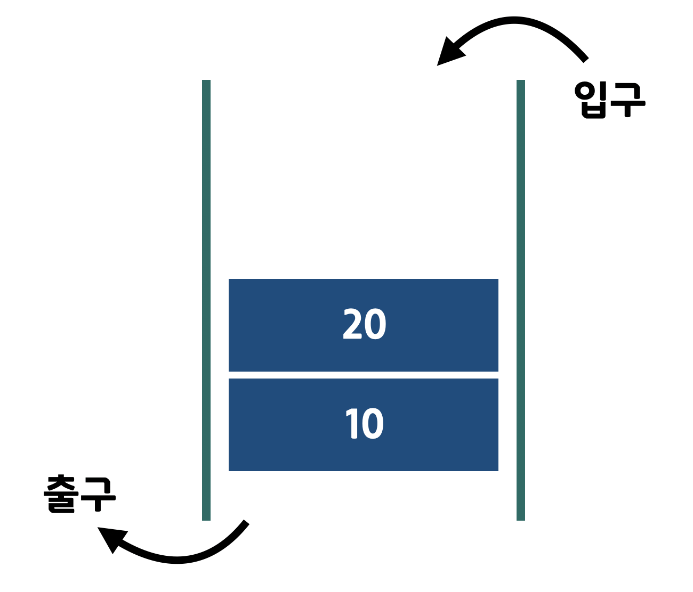
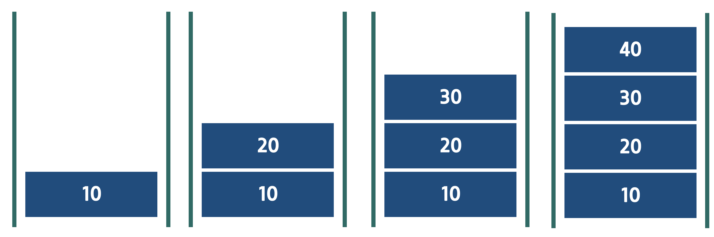
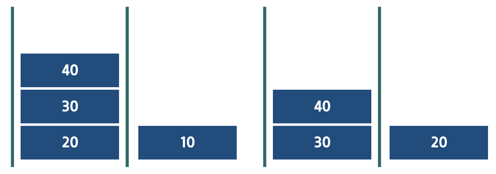

# 15. 큐 (queue)

## 입구와 출구가 다른 상자 

 

* 스택과 다르게 입력 하는 방향과 출력 하는 방향이 반대로 되어 있다. 



* 쌓는 형태는 스택과 유사하다. 



* 꺼낼 때는 밑에서 하기 때문에, 스택과 달리 먼저 저정된 값이 먼저 꺼내어 진다. 
* 이러한 것을 **선입 선출, FIFO(First In First Out)** 라고 한다. 

## 큐
* 선입선출, FIFO의 특성을 가진 자료 구조를 큐라고 한다. 
* 큐는 우리가 일상적으로 사용 하는 형태의 자료 구조이다. 
* 대표 적으로 맛집에서 기다릴때 먼저 온사람이 먼저 들어가고, 은행에서 번호표를 먼저 뽑은 사람이 먼저 사용 하는 것과 같은 것이다. 
* 많은 데이터를 한번에 처리 하지 못할 때, 데이터를 차례대로 처리 하기 위해서, 대기 시키는 용도로 사용 될 수 있다. 

## 큐의 기능 
* put
	* 큐에 값을 저장 한다. 값은 기존 데이터 뒤에 쌓인다. 
* get
	*  큐의 값을 꺼낸다. 가장 먼저 저장된 값, 즉 가장 아래의 값을 얻는다. 
	*  값을 꺼내기 때문에, 값을 큐에서 지운다. 
*  front
	* 큐에서 가장 아래의 값을 얻는다. 
	*  값만 확인하는 것이기 때문에 값을 지우지 않는다. 

## 배열을 통한 큐 구현
* 배열을 통해서 큐를 구현할 때는 입구와 출구의 index를 관리 하는 것이 중요하다. 

| [0] | [1] | [2] | [3] | [4] | [5] | [6] | [7] | [8] | [9] |
|:---:|:---:|:---:|:---:|:---:|:---:|:---:|:---:|:---:|:---:|
| 0  | 0  | 0  | 0  | 0  | 0  | 0  | 0  | 0  | 0  |

* 위와 같은 배열이 있을때, 입구는  index 9 방향에서 들어 와서 index 0번째 부터 쌓인다고 생각하면 된다. 
* 출구는 index 0 번쪽이라고 생각 하면 된다. 

```
int queue[10] = {0, };
    
int frontIndex = 0;
int rearIndex = 0;
```
* 출구 index 를 frontIndex 변수로 관리 한다. 
* 제일 위 쪽 은 rearIndex 변수로 관리 한다. 
* front 를 입구, rear 를 입구로 생각 하면 편리하다. 

```
queue[rearIndex] = 10;
rearIndex++;
queue[rearIndex] = 20;
rearIndex++;
queue[rearIndex] = 30;
rearIndex++;
queue[rearIndex] = 40;
rearIndex++;
```
* put 하는 과정이다. 
* rearIndex 에 값을 넣고, rearIndex 를 1 증가 시켜서 입구를 관리 해준다. 

| front  |  |  | |  rear |  | |  |  |  |
|:---:|:---:|:---:|:---:|:---:|:---:|:---:|:---:|:---:|:---:|
| [0] | [1] | [2] | [3] | [4] | [5] | [6] | [7] | [8] | [9] |
| 10  | 20  | 30  | 40  | 0  | 0  | 0  | 0  | 0  | 0  |

```
int number = queue[frontIndex];
frontIndex++;
```

* get을 하는 과정이다. 
* front를 가르키는 frontIndex의 값을 number에 저장 하여 값을 저장한다. 
* frontindex의 값을 증가 시켜서 꺼낸이 없어지도록 한다. 

|  | front |  | |  rear |  | |  |  |  |
|:---:|:---:|:---:|:---:|:---:|:---:|:---:|:---:|:---:|:---:|
| [0] | [1] | [2] | [3] | [4] | [5] | [6] | [7] | [8] | [9] |
| 10  | 20  | 30  | 40  | 0  | 0  | 0  | 0  | 0  | 0  |

* 이렇게 front 위치를 옮겨서 20, 30, 40 세개의 값만 남은 것처럼 처리 한다. 

[예제 보기](ex/ex01.c)

## 전역 변수와 함수를 이용한 큐 구현

```
int queue[10] = {0, };
int frontIndex = 0;
int rearIndex = 0;

int main() {
	return  0;
}
```

* 큐를 저장 할 배열과, 입구와 출구를 관리할 index 변수를 전역으로 선언 해준다. 

```
int isFull() {
    if(rearIndex == 10){
        return 1;
    }
    return 0;
}

void put(int value) {
    if(isFull()) {
        printf("push 실패\n");
        return ;
    }
    queue[rearIndex++] = value;
}
```
* put을 구현한 함수 이다. 

`queue[rearIndex++] = value;`

* 큐에 현재 입구에 해당하는 rearIndex 위치에 값을 저장하고, 후위 연산을 통해서 값을 증가 시킨다. 

` if(isFull())`
* 배열이 가득 찼을때, 더이상 put이 되지 않도록 isFull 함수를 만들어서, 예외 처리를 하였다. 

```
int empty() {
    if(count() == 0) {
        return 1;
    }    
    return 0;
}

int front() {
    if(empty()) {
        printf("front 실패\n");
        return 0;
    }
    return queue[frontIndex];
}
```
* front 함수를 구현한 내용이다. 

` return queue[frontIndex];`

* 출구에 해당하는 frontIndex 위치를 통해서 값을 return 한다. 

`if(empty())`  

* 큐가 비어 있을때, 값을 가져오지 못하도록, empty 함수를 만들어서 예외처리를 하였다. 

```
int get() {
    if(empty()) {
        printf("dequeue 실패\n");
        return 0;
    }
    return queue[frontIndex++];
}
```
* get 함수를 구현한 내용이다. 

`return queue[frontIndex++];`

* 출구에 해당하는 frontIndex 위치를 통해서 값을 return 한다. 
* frontIndex 를 1 증가 시켜서 출구의 위치를 옮겨서 가장 아래쪽 값을 제거해 준다.

`if(empty())`  

* 큐가 비어 있을때, 값을 가져오지 못하도록, empty 함수를 만들어서 예외처리를 하였다. 

```
void printQueue() {
    for(int i = frontIndex; i < rearIndex; i++) {
        printf("%d\n", queue[i]);
    }
}
```

* 전체 큐의 내용을 출력 하기 위한 함수도 구현 하였다. 

```
int main() {
 
    put(10);
    put(20);
    put(30);
    put(40);
    
    printQueue();
    printf("\n");
    
    printf("front : %d\n\n", front());
    
    printQueue();
    printf("\n");
    
    printf("get : %d\n\n", get());
    
    printQueue();
    printf("\n");
    
    return 0;    
}
```

> 출력 결과 

```
10
20
30
40

front : 10

10
20
30
40

get : 10

20
30
40
```

[예제보기](ex/ex02.c)

## 배열을 이용한 큐의 치명적 단점
* 큐에서 get을 할때 frontIndex 값을 증가 시키면서 데이터를 지우기 때문에, put과 get응 지속 할 수록 저장 할 수 있는 공간이 줄어 즐게 된다. 

put(10);
put(20);
put(30);
put(40);

| front | |  | |  rear |  | |  |  |  |
|:---:|:---:|:---:|:---:|:---:|:---:|:---:|:---:|:---:|:---:|
| [0] | [1] | [2] | [3] | [4] | [5] | [6] | [7] | [8] | [9] |
| 10  | 20  | 30  | 40  | 0  | 0  | 0  | 0  | 0  | 0  |

get();  
get();  
get();  

|  | |  | front |  rear |  | |  |  |  |
|:---:|:---:|:---:|:---:|:---:|:---:|:---:|:---:|:---:|:---:|
| [0] | [1] | [2] | [3] | [4] | [5] | [6] | [7] | [8] | [9] |
| 10  | 20  | 30  | 40  | 0  | 0  | 0  | 0  | 0  | 0  |

put(50);  
put(60);  
put(70);  
put(80);  

|  | |  | front |  |  | |  | rear |  |
|:---:|:---:|:---:|:---:|:---:|:---:|:---:|:---:|:---:|:---:|
| [0] | [1] | [2] | [3] | [4] | [5] | [6] | [7] | [8] | [9] |
| 10  | 20  | 30  | 40  | 50  | 60  | 70  | 80  | 0  | 0  |

get();  
get();  
get();  

|  | |  | |  |  | front |  | rear |  |
|:---:|:---:|:---:|:---:|:---:|:---:|:---:|:---:|:---:|:---:|
| [0] | [1] | [2] | [3] | [4] | [5] | [6] | [7] | [8] | [9] |
| 10  | 20  | 30  | 40  | 50  | 60  | 70  | 80  | 0  | 0  |

* front 가 앞으로 당겨지는 만큼 저장 할 공간이 사라진다. 
* 따라서 배열을 통한 방식 보다는 연결 리스트를 통한 방식이 훨씬 효율 적이다. 

##  연결 리스트를 이용한 큐
* 배열을 사용 했을때, 스택에 비해서 훨씬 큰 단점을 가지고 있기 때문에, 큐는 되도록이면 연결 리스트로 관리하는 것이 좋다. 

```
typedef struct _Node {
    int number;
    struct _Node *next;
} Node;

int main() {
 
    Node *head = (Node *)malloc(sizeof(Node));
    head->next = NULL;
    return  0;    
}
```

* Node 를 통해서 head 를 만들고 초기화 해준다. 

```
void put(Node *head, int number) {
    Node *newNode = (Node *)malloc(sizeof(Node));
    newNode->number = number;
    newNode->next = NULL;
    
    Node *pointer = head;
    while(pointer->next != NULL) {
        pointer = pointer->next;
    }
    
    pointer->next = newNode;
}
```

* put을 구현한 함수이다. 
* 연결리스트에서 큐는 head 쪽이 출구이고, 가장 뒤쪽이 입구가 된다. 
* 따라서 새로 추가되는 노드는 연결리스트 가장 뒤에 추가 되어야 한다. 
* 따라서 반복문을 통해 가장 뒤쪽의 노드를 찾고 그 next 에 새로운 노드를 추가 해준다. 

```
int front(Node *head) {
    if(head->next == NULL) {
        printf("front 실패\n");
        return 0;
    }
    return head->next->number;
}
```

* front 를 구현한 함수이다. 
* head 의 next 출구 즉 front 가 되기 때문에, 해당 값을 리턴해주면 된다. 
* 비어 있을 경우를 대비해 `if(head->next == NULL)` 를 통해서 예외 처리를 한다. 

```
int get(Node *head) {
    if(head->next == NULL) {
        printf("get 실패\n");
        return 0;
    }
 
    Node *front = head->next;
    int number = front->number;
    head->next = front->next;
    free(front);
    
    return number;
}
```

* front가 제거 될 것이 기 때문에 return 할 값을 먼저 number에 저장해 둔다. 
* head 의 next를 새로운 front가 될, front 의 next 로 바꿔 준다. 
* front은 free를 통해서 메모리를 해제 해준다. 
* 저장해둔 number를 return 한다. 

```
int main() {
 
    Node *head = (Node *)malloc(sizeof(Node));
    head->next = NULL;
    
    put(head, 10);
    put(head, 20);
    put(head, 30);
    put(head, 40);
    
    printQueue(head);
    printf("\n");
    
    printf("front : %d\n\n", front(head));
    
    printQueue(head);
    printf("\n");
    
    printf("dequeue : %d\n\n", get(head));
    
    printQueue(head);
    printf("\n");
    
    retrun 0;    
}
```

* 위와 같이 간단하게 사용 할 수 있다. 

> 출력 예시 

```
10
20
30
40

front : 10

10
20
30
40

get : 10

20
30
40
```


