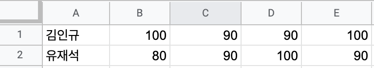

# 16. 파일 다루기

## 파일 포인터

* 파일을 다루기 위해서는 파일을 관리하는 포인터 변수가 필요 하다. 
* 파일 포인터는 fopen 이라는 함수를 통해서 얻을 수 있다. 

```
FILE *fp = NULL;
fp = fopen("test.txt", "w");
```

* 파일 포인터 변수는 **FILE** 라는 타입으로 선언해준다. 
* fopen() 함수의 첫번쨰 파라미터는 접근하고자 하는 파일의 경로와 파일이름을 넣어 준다. 
* 두번째 파라미터는 파일을 어떤 형태로 열 것인지를 나타내는 **모드** 값을 지정해준다. 

|mode|설명|
|:---:|:---:|
| "w"|파일을 쓴다. 파일이 없을 경우 파일을 새로 만들고, 파일이 있을 경우 기존 내용을 모두 제거 하고 다시 쓴다.|
| "w+"|"w" 와 같은 기능에 읽기 기능이 추가 된다.|
|"a"|파일을 이어서 쓴다. 파일이 없을 경우 파일을 새로 만들고, 파일이 있을 경우 기존 내용 뒤에 붙어셔 쓴다. |
| "a+"|"a" 와 같은 기능에 읽기 기능이 추가 된다.|
|"r"| 파일을 읽는다. 파일이 없는 경우 에러가 발생한다. |
|"r+"|r 과 같은 기능에 쓰기 기능이 추가 된다.|

* 모드는 위와 같이 6개가 존재한다. 
* 안정성을 위해서 뒤에 + 를 추가하는 모드는 사용 하는 것을 권장 하지 않는다. 
* 따라서 "w" "a" "r" 세가지만 쓰는 것을 추천한다. 

```
fclose(fp);
```

* 파일을 fopen 을 통해서 파일을 열고 파일을 다 쓴경우 꼭 fclose 를 통해서 파일을 닫아 주어야 한다. 
* 컴퓨터를 쓰면서 흔히 다른 프로그램에서 파일을 사용 중일때 다른 곳에서 수정이 안되기 때문에, fclose 를 해주지 않으면, 그 파일은 계속 다른 곳에서 사용 할 수 없게 된다. 

## 파일 쓰기 
* 파일을 열고 파일 포인터를 이용해서 파일을 쓸 수 있다. 

```
FILE *fp = fopen("test.txt", "w");
    
fprintf(fp, "Hello World\n");
int noodleCup = 850;
fprintf(fp, "육개장 %d원\n", noodleCup);
    
fclose(fp);
```
`fprintf(fp, "Hello World\n");`

* fprintf 함수는 첫번째 파라미터로 파일 포인터를 넣어 준다. 그리고 그 뒤는 printf 함수와 사용방법이 똑같다. 
* fclose 될떄 까지 fprintf 를 통해서 쓴 내용이 파일에 저장이 된다. 

> 파일 내용 (test.txt) 

```
Hello World
육개장 850원
```

* 기존에 있는 파일이름으로 "w" 모드로 파일을 쓸경우 기존 내용이 모두 지워지고 새롭게 써진다. 
* 기존 파일에 추가로 내용을 쓰고 싶을때는 아래와 같이 해야 한다. 

```
fp = fopen("test.txt", "a");
    
fprintf(fp, "추가\n");
fprintf(fp, "추가 2222222\n");
    
fclose(fp);
```

* fopen 에서  모드를 "a" 로 해주고, 기존 파일 쓰는 방법과 똑같이 하면, 기존 파일에 추가로 쓸 수 있다. 

> 파일 내용 (test.txt)

```
Hello World
육개장 850원
추가
추가 2222222
```

## 파일 읽기 

* 기존에 있는 파일을 대상으로 파일을 읽어서 그 값을 사용 할 수 있다. 

```
fp = fopen("test.txt", "r");
char readString[128];
fscanf(fp, "%s", readString);
printf("%s\n", readString);
    
fscanf(fp, "%s", readString);
printf("%s\n", readString);
    
fscanf(fp, "%s", readString);
printf("%s\n", readString);
    
int number = 0;
fscanf(fp, "%d", &number);
printf("%d\n", number);
```

* "r" 모드를 통해서 파일을 열어 준다. 

`fscanf(fp, "%s", readString);`

* fscanf 함수를 통해서 값을 하나씩 읽어 올 수 있다. 
* 첫번쨰 파라미터에 파일 포인터를 넣어 주고, 그 뒤 부분은 scanf 와 사용 법이 동일 하다. 
* %s 로 읽을 경우 공백을 기준으로 값을 가져 오게 된다. 

`fscanf(fp, "%d", &number);`

* scanf 처럼 서식 지정자를 통해서 타입에 맞춰서 값을 읽어 올 수 있다. 
* fscanf 를 할떄 마다 파일 내용을 다음 것을 차례 대로 읽게 된다. 

> 출력 예시 

```
Hello
World
육개장
850
```
* 파일을 읽고 싶은 위치를 옮길 수 있다. 

```
fseek(fp, 0, SEEK_SET);
    
fscanf(fp, "%s", readString);
printf("%s\n", readString);
```
* fseek 라는 함수를 통해서 기존에 다 읽은 파일에서 다시 처음 부터 다시 읽게 구현 한 것이다. 

```
fseek(fp, 0, SEEK_SET);
```
* 첫번째 파라미터는 파일 포인터를 넣어 준다. 
* 두번째 파라미터는 옮기고 싶은 위치의 값을 넣어 준다. 문자 하나를 1로 하는 값을 넣어 주면된다. 
* 마지막에는 SEEK_SET 키워드를 넣어 주면 된다. 

> 출력 예시 

```
Hello
```

## 반복문을 통한 파일 읽기 

* 여러 줄이 들어 있는 파일에서 파일 마지막 까지 읽기 위해서 반복문을 이용 할 수 있다. 

```
while(fscanf(fp, "%s", readString) != EOF) {
    char *newString = (char *)malloc(sizeof(char) * strlen(readString) + 1);
    strcpy(newString, readString);
    printf("%s\n", newString);
}
```

`while(fscanf(fp, "%s", readString) != EOF)`

* fscanf 이 파일을 끝을 만났을 때 EOF 라는 키워드를 return 한다. 
* 이를 이용해서 EOF 가 아닐 경우 반복을 하도록 조건을 만들 수 있다. 

`char *newString = (char *)malloc(sizeof(char) * strlen(readString) + 1);`

* readString 을 복사할 공간을 동적 메모리 할당을 통해서 만들어서 사용 할 수 있다. 

## CSV 

* csv 를 활용하면, 파일 일기를 좀 더 실효성 있게 사용 할 수 있다. 
* csv 란, 엑셀 이나 구글 스프레드 시트와 같은 스프레드 시트 데이터를 단순화 해서 저장 하는 파일을 말한다. 



* 위와 같은 형태의 내용의 스프레드 시트는 아래와 같이 csv 파일로 표현된다. 

```
김인규,100,90,90,100
유재석,80,90,100,90
```
* 행은 **줄바꿈** 열은 **,(쉼표)** 로 구분 된다. 
* csv 파일은 엑셀, 구글 스프레드시트, Numbers 같은 대부분의 스프레드 시트 프로그램에서 손쉽게 파일을 열고, 저장 할 수 있다. 

## CSV 파일 다루기 

> test.csv

```
김인규,100,90,90,100
유재석,80,90,100,90
```

* 위 파일을 기반으로 csv 파일을 다루는 예제는 아래와 같다. 

```
p = fopen("test.csv", "r");
    
while(fscanf(fp, "%s", readString) != EOF)  {
    
    char *newString = (char *)malloc(sizeof(char) * strlen(readString) + 1);
    strcpy(newString, readString);
    
    char *str = strtok(newString, ",");
    
    int i = 0;
    char *name = NULL;
    int scores[4] = {0, };
    
    while(str != NULL) {
        if(i == 0) {
            name = (char *)malloc(sizeof(char) * strlen(str) + 1);
            strcpy(name, str);
        } else {
            scores[i - 1] = atoi(str);
        }
        
        str = strtok(NULL, ",");
        i++;
    }
    
    printf("%s - ", name);
    
    for(int i = 0; i < 4; i++) {
        printf("%d점 ", scores[i]);
    }
    
    printf("\n");
    
}
```
`while(fscanf(fp, "%s", readString) != EOF)  `

* 모든 행을 읽기 위해서 반복문을 사용한다. 

`char *str = strtok(newString, ",");`

* 행을 분리 하기 위해서 **,(쉼표)** 를 기준으로 strtok 을 실행해 준다. 

```
if(i == 0) {
    name = (char *)malloc(sizeof(char) * strlen(str) + 1);
    strcpy(name, str);
} else {
    scores[i - 1] = atoi(str);
}

```

* 들어 있는 데이터 규격에 맞게 첫번째 열의 값은 char* 로 문자열로 저장한다. 
* 두번쨰 부터 값은 atoi 를 이용해서 문자열을 숫자로 변환 하여 저장한다. 

```
printf("%s - ", name);
    
for(int i = 0; i < 4; i++) {
    printf("%d점 ", scores[i]);
}
```

* 분리하여 저장한 데이터를 알맞은 형태로 출력 한다. 

> 출력 결과 

```
김인규 - 100점 90점 90점 100점 
유재석 - 80점 90점 100점 90점 
```

* 이렇게 스프레드 시트 프로그램을 통해서 입력된 많은 데이터를 csv 로 저장해서 어렵지 않게 데이터를 관리 할 수 있다. 

[예제보기](ex/ex01.c)