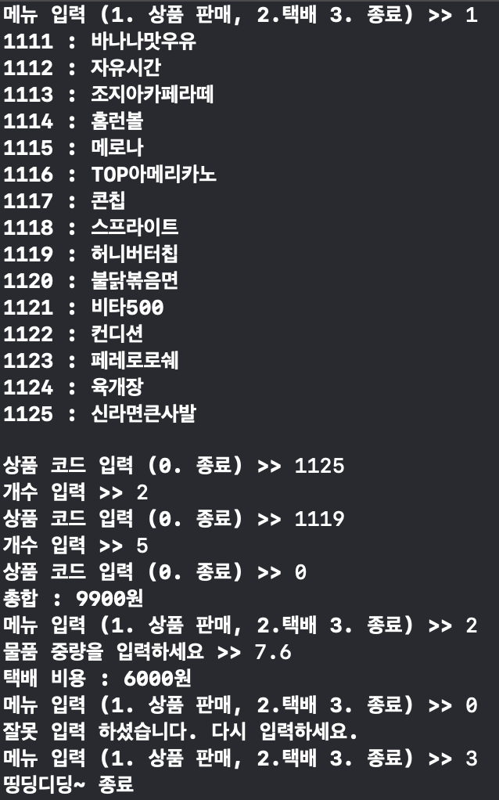
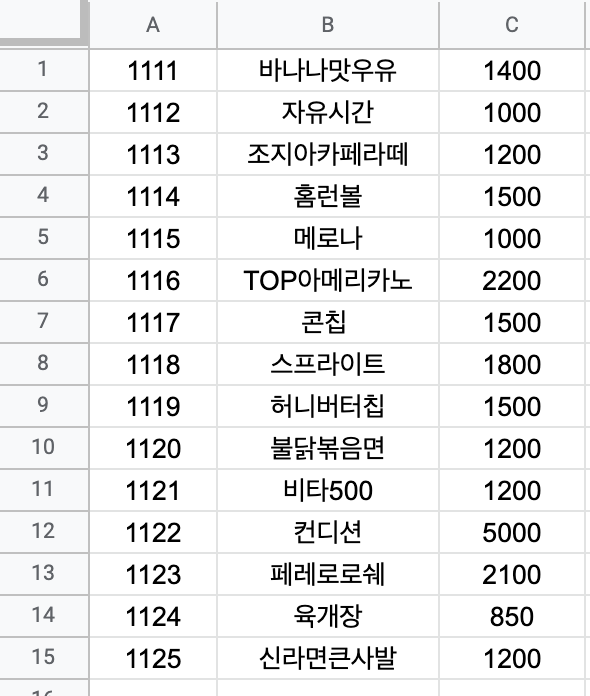

## 편의점 POS 만들기

* POS 는 Point of sales의 약자로 판매시점 정보관리 라고 한다. 
* 우리가 일반적으로 편의점에 바코드 찍고 계산 해주는 컴퓨터를 의미한다. 
* POS에는 많은 기능이 있지만, 기본적인 입력을 받고 계산하는 프로그램을 만들어 보려고 한다. 

* 입력을 통해서 상품 판매, 택배, 종료등을 선택 하게 한다. 
	* 상품 판매를 선택하면, csv 를 통해서 저장한 상품 정보를 출력 한다. 
	* 상품 코드와 개수를 여러번 입력 받고, 종료를 선택하면 그 결과를 출력 한다.  
	* 택배를 선택하면, 중량을 입력 받고, 중량에 다른 비용을 출력 한다. 
	* 종료를 선택하면 프로그램을 종료 한다. 

* 상품 정보는 아래와 같이 csv로 제공 된다. 

* 아래 순서대로 각 단계 별로 코딩을 진행 한다. 

### [메뉴 입력](step/step1/README.md)

 * 어떤 작업을 수행 할지 정한다. 
 * 1. 상품 판매 2. 택배 3. 종료
 * 종료가입력 될때 까지 반복 수행된다.

### [택배](step/step2/README.md)

* 중량에 따른 택배비를 구한다. 

### [상품 입력](step/step3/README.md)
* 상품 코드, 상품 이름, 상품 가격을 csv 파일을 통해서 입력 받아서 연결 리스트에 저장한다.

### [상품 판매](step/step4/README.md)

* 상품 코드와 개수를 입력 받는다. 
* 상품 코드 입력 시에 0이 입력 될때 까지 반복 수행한다. 
* 0을입력 받으면, 지금 까지 입력된 합을 구한다.

